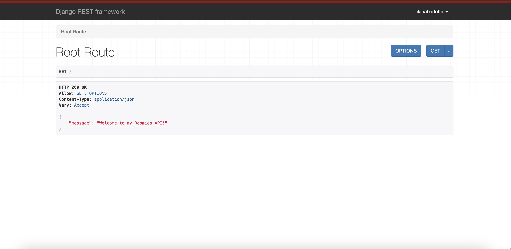
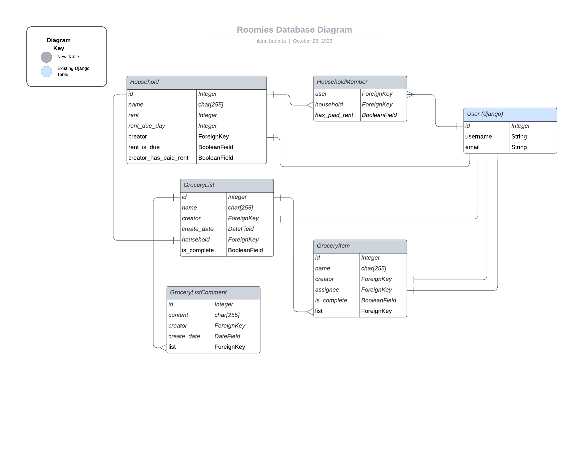
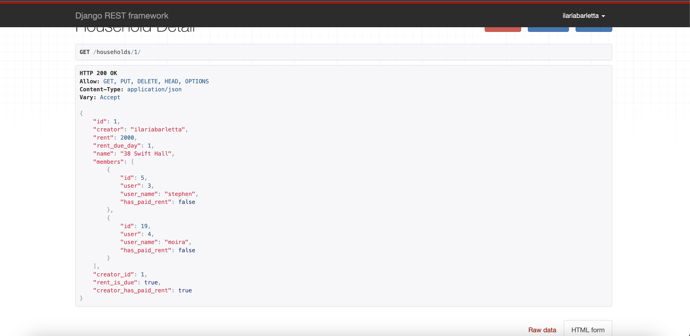
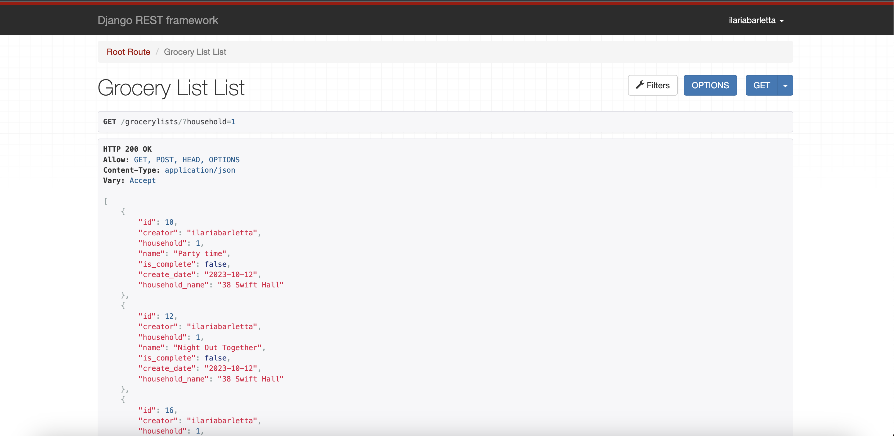

# Roomies API 
This repository contains the code which provides the API endpoints necessary to allow the Roomies application to retrieve and store its data. 

# Planning & Design 

## Database Design 

## API Goals 
* Allow users to register/login to the Roomies app 
* Allow users to create `Household`'s, which is the primary model that connects all the functionality of the app. 
* Allow users to add/remove other users to their `Household`
* Allow users to create `Grocery Lists` for their `Household`
* Allow users to add `Grocery Items` to their `Grocery Lists`
* Allow users to add `Comments` to their `Grocery Lists`
* Provide CRUD functionality for the database models created 

# Technologies Used 
* Django 
* Python 
* ElephantSQL 
* Django Rest Framework
* Django Rest Auth 
* Django Filters 

# Features 

## Households 
I have created API's to allow users to interact with `Household` related functionality. Below is a list of the endpoints that the React application can access: 

| Endpoint        | HTTP Methods     | Description  |
| --------------- | ---------------- | ------------ |
| `/households`   | `GET`, `POST`    | Allow users to list households and create new households |
| `/households/:id` | `GET`, `DELETE`, `PUT` | Allow users to retrieve, delete, or update a single household | 
| `/households/:id/members` | `GET`, `POST` | Allow users to list or add members to their household | 
| `/households/:id/members/:memberId` | `GET`, `PUT`, `DELETE` | Allow users to retrieve, update, or delete a member of a household |
| `/households/:id/availableusers` | `GET` | Allow users to retrieve a list of the possible members that can be added to a household |
| `/households/:id/markrentdue` | `POST` | Allow household creators to mark the rent of their household as due. |

### Example
Below is a screenshot from the API showing an example of one of the above API's 

## Grocery Lists
I have also created API's to allow users to manage `Grocery Lists` for their household. Below is a list of endpoints that the React application can access:

| Endpoint        | HTTP Methods     | Description  |
| --------------- | ---------------- | ------------ |
| `/grocerylists`   | `GET`, `POST`    | Allow users to list grocery lists and create new grocery lists |
| `/grocerylists/:id`   | `GET`, `DELETE`, `PUT`    | Allow users to retrieve, update, or delete a single grocery list |
| `/groceryitems`   | `GET`, `POST`    | Allow users to list grocery items for a particular list, as well as create new ones. |
| `/groceryitems/:id`   | `GET`, `PUT`, `DELETE`    | Allow users to retrieve, update, or delete a particular grocery list item |
| `/grocerylistcomments`   | `GET`, `POST`    | Allow users to list the comments for a particular grocery list as well as create new ones. |
| `/grocerylistcomments/:id`   | `GET`, `PUT`, `DELETE`    | Allow users to retrieve, update, or delete a particular grocery list comment |

### Example
Below is a screenshot from the API showing an example of one of the above API's 

## Authentication and Permissions 

### Authentication 
The use of the API is restricted to authenticated users only. Users who have not logged in will receive a `HTTP 403` if they try and access the API without logging in. 

### Permissions 
I have created several custom permissions which allows me to further restrict access to the data, beyond just ensuring that the user has logged in. They have been detailed below. 

| Name            | Description  |
| --------------- |------------ |
| `IsCreatorOrReadOnly`   | Allows write access to a model if the current user is the `creator`, otherwise read-only access.    |
| `CanManageHousehold`   | Allows read/write access to a `Household` model if the user is either the `creator` or exists in the `members` relation list    |
| `CanManageGroceryList`   | Allows read/write access to a `GroceryList` model if the user is either the `creator` or exists in the `members` relation list of the `Household` associated with the list.   |
| `CanManageGroceryItem`   | Allows read/write access to a `GroceryListItem` model if the user is either the `creator` or exists in the `members` relation list of the `Household` associated with the list that the item belongs to.   |

# Agile Development 
I have created a Github project to track the user stories for the entire application (API and UI) and that can be viewed [here](https://github.com/users/ilaria-barletta/projects/3/views/1)

I have also created several Github Milestones to track the Epics for the application and they can be viewed [here](https://github.com/ilaria-barletta/roomies-api/milestones?with_issues=no)

# Testing 

## Manual Testing 
I have tested the app thoroughly and you can see the outcome of the manual testing below where I've detailed each feature tested in separate tables. You can also see the user story in Github which contains the acceptance criteria which aided the testing. 

1. Create a household [story](https://github.com/ilaria-barletta/roomies-api/issues/3)

| Test        | Outcome     |
| ----------- | ----------- |
| Only logged in users can create a household       | Pass        |
| Users must provide a name for their household      | Pass        |
| The user is able to provide `rent` as an optional field      | Pass        |

2. Update a household [story](https://github.com/ilaria-barletta/roomies-api/issues/4)

| Test        | Outcome     |
| ----------- | ----------- |
| Only logged in users can update a household       | Pass        |
| Users must provide a name for their household      | Pass        |
| The user is able to provide `rent` as an optional field      | Pass        |
| Only the `creator` or a `member` of the household can update the household      | Pass        |

3. View a household [story](https://github.com/ilaria-barletta/roomies-api/issues/5)

| Test        | Outcome     |
| ----------- | ----------- |
| Only logged in users can view a household       | Pass        |
| Only the `creator` or a `member` of the household can view the household     | Pass        |

4. Create a grocery list [story](https://github.com/ilaria-barletta/roomies-api/issues/17)

| Test        | Outcome     |
| ----------- | ----------- |
| Users must provide a `household` to associate with their grocery list     | Pass        |
| Users must provide a `name` for their grocery list     | Pass        |

5. View a grocery list [story](https://github.com/ilaria-barletta/roomies-api/issues/16)

| Test        | Outcome     |
| ----------- | ----------- |
| Only users who are a member or the creator of the lists associated `household` can view the list    | Pass        |
| Only logged in users can view the list   | Pass        |

6. Delete a grocery list [story](https://github.com/ilaria-barletta/roomies-api/issues/15)

| Test        | Outcome     |
| ----------- | ----------- |
| Only users who are a member or the creator of the lists associated `household` can delete the list    | Pass        |
| Only logged in users can delete the list   | Pass        |

7. Update a grocery list [story](https://github.com/ilaria-barletta/roomies-api/issues/12)

| Test        | Outcome     |
| ----------- | ----------- |
| Only users who are a member or the creator of the lists associated `household` can update the list    | Pass        |
| Only logged in users can update the list   | Pass        |

8. Update a grocery list completion status [story](https://github.com/ilaria-barletta/roomies-api/issues/11)

| Test        | Outcome     |
| ----------- | ----------- |
| Only users who are a member or the creator of the lists associated `household` can mark the list as complete/incomplete    | Pass        |
| Only logged in users can mark the list as complete/incomplete   | Pass        |

9. Create a grocery list item [story](https://github.com/ilaria-barletta/roomies-api/issues/14)

| Test        | Outcome     |
| ----------- | ----------- |
| Users must provide a `name` for their grocery list item    | Pass        |
| Users can optionally provide a `assignee` for their grocery list item     | Pass        |

10. Update a grocery list item [story](https://github.com/ilaria-barletta/roomies-api/issues/9)

| Test        | Outcome     |
| ----------- | ----------- |
| Users must provide a `name` for their grocery list item    | Pass        |
| Users can optionally provide a `assignee` for their grocery list item     | Pass        |
| Only a member of the associated household for the list can update a grocery list item    | Pass        |

11. Delete a grocery list item [story](https://github.com/ilaria-barletta/roomies-api/issues/13)

| Test        | Outcome     |
| ----------- | ----------- |
| Only a member of the associated household for the list can delete a grocery list item    | Pass        |

12. Update a grocery list item completion status [story](https://github.com/ilaria-barletta/roomies-api/issues/10)

| Test        | Outcome     |
| ----------- | ----------- |
| Only a member of the associated household for the list can update a grocery list item completion status  | Pass        |

13. Create a grocery list comment [story](https://github.com/ilaria-barletta/roomies-api/issues/2)

| Test        | Outcome     |
| ----------- | ----------- |
| Users must provide a `content` for their grocery list comment    | Pass        |

14. Update a grocery list comment [story](https://github.com/ilaria-barletta/roomies-api/issues/7)

| Test        | Outcome     |
| ----------- | ----------- |
| Users must provide a `content` for their grocery list item    | Pass        |
| Only the `creator` of the comment can update it    | Pass        |

15. Delete a grocery list comment [story](https://github.com/ilaria-barletta/roomies-api/issues/1)

| Test        | Outcome     |
| ----------- | ----------- |
| Only the `creator` of the comment can delete it    | Pass        |

## Validators

 * [python](https://pep8ci.herokuapp.com) testing
  

# Deployment, Forking and Cloning 

## Deployment
The project has been deployed using Heroku. Here are the step to follow for the deployement:

1. Access your Heroku account and click on "create a new app", name the app and select the region before hitting the create app button.   
2. Navigate to the settings tab and create config vars for cloudinary, the database, and the secret key
3. Navigate to the deploy section and select Github as deployment method. After confirming that we want to connect to Github we can then search for the Github repository name. Once we find it we can click on connect. 
5. Scroll down and select enable automatic deploys

The live link to my project is here: https://roomiesapi-637170cefd22.herokuapp.com/

## Forking & Cloning
To fork this repository click on the "Fork" button in the top right of the repository in Github. 

To clone this repository:
1. Click the "Code" button in the repository. 
2. Copy the clone link.
3. Use git to clone the copied link: `git clone LINK`. 

___
# References & Credits
* I used the Django Rest Framework Code Institute project as the reference for some of the parts of the project. In particular, the authentication, and filtering I learned from following along with that project. 

I also used Stackoverflow for some common Django and Django Rest Framework questions: 

1. https://stackoverflow.com/questions/76201342/how-to-pass-a-url-parameter-in-get-queryset-method-in-django-rest-view 
2. https://stackoverflow.com/questions/431628/how-to-combine-multiple-querysets-in-django

I also used the Django Rest Framework documentation to find out how to make the entire API only available to logged in users. 

1. https://www.django-rest-framework.org/api-guide/permissions/ 